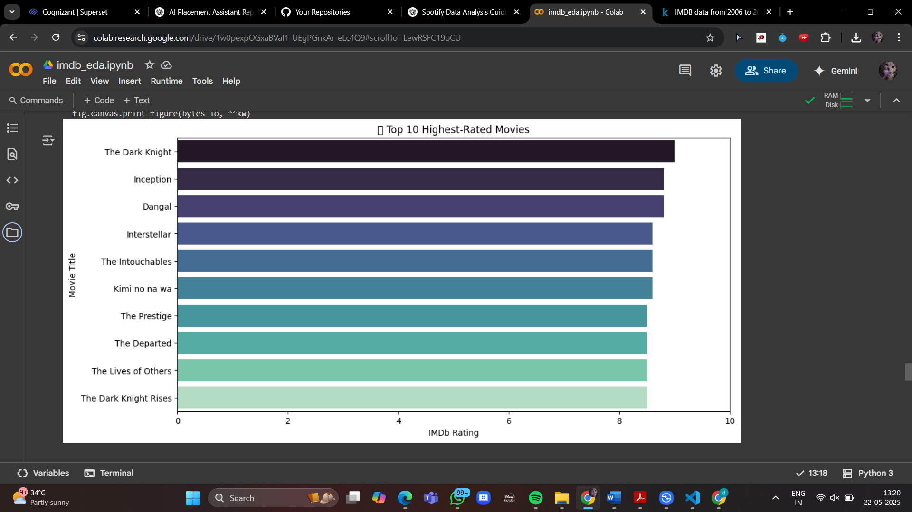
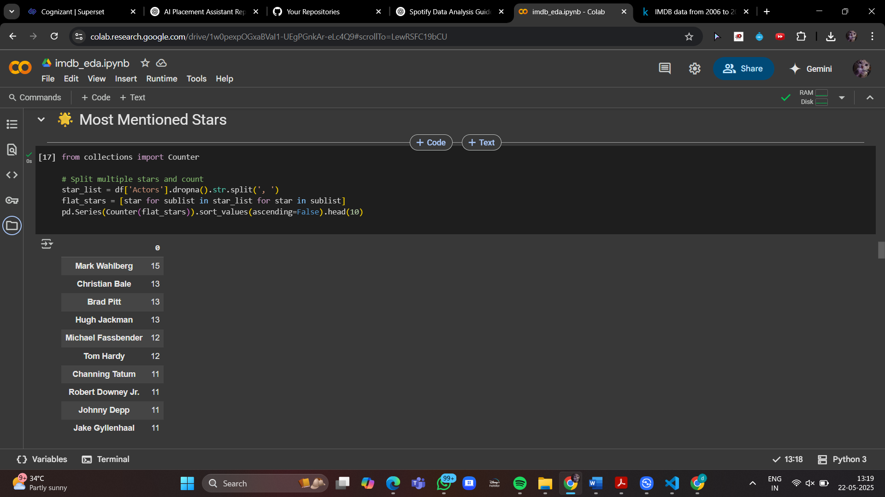
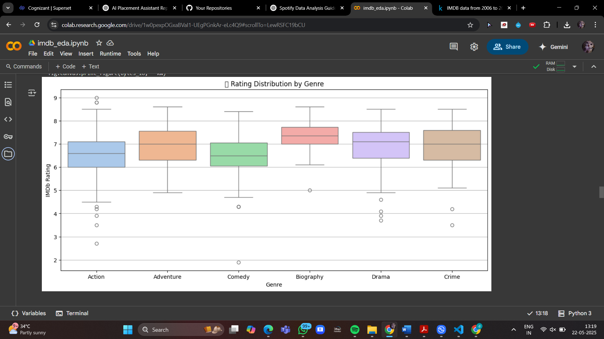
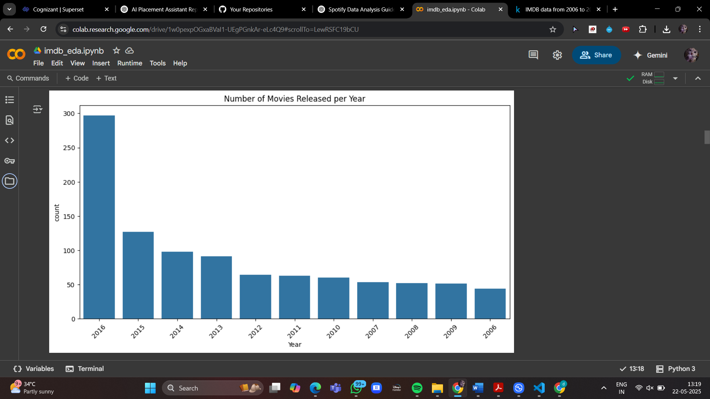

# 🍿 IMDb Movie Explorer: Trends, Genres & Stars (2006–2016)

Welcome to a data-driven walk down the red carpet 🎬✨ — this project dives into **IMDb movie data from 2006 to 2016**, uncovering cinematic trends, genre patterns, standout directors, and star-studded performances.

Let’s turn raw data into box office brilliance! 💥

---

## 📂 Dataset Overview

The dataset is sourced from [Kaggle's IMDb collection](https://www.kaggle.com/datasets) and contains rich metadata like:
- 🎞️ Movie titles & release years  
- 📌 Genres & durations  
- ⭐ IMDb ratings  
- 🎬 Directors and actors  
- 🔢 Number of votes (where available)

---

## 📈 What This Analysis Reveals

- 🧹 Clean and curated movie metadata  
- 📊 Gorgeous plots via **Matplotlib** & **Seaborn**  
- 🔍 Rating trends across years and genres  
- 🧑‍🎤 Actor & director performance metrics  
- 🎯 Smart filtering (e.g., actors with 3+ appearances)  
- 🖼️ Visual storytelling inside a polished Jupyter Notebook  

---

## 🖼️ Featured Visuals

### 🎞️ Best-Rated Movies

### 👥 Most Featured Actors

### 🎭 Ratings by Genre

### 📆 Release Trend Over Time

---

## 🛠️ Running This Notebook

Want to play with the code? Here's how:

1. 📥 Clone or download this repo  
2. 📂 Open the `.ipynb` notebook in [Google Colab](https://colab.research.google.com/)  
3. 📊 Upload the IMDb CSV file (from Kaggle)  
4. 🚀 Run cells to reveal cinematic insights!

---

## 🧠 Tools & Techniques

- 🐼 **Pandas**: Data wrangling like a pro  
- 🧹 Data cleaning & transformation  
- 📈 **Seaborn** & **Matplotlib**: Aesthetic data viz  
- 🔍 EDA (Exploratory Data Analysis)  
- 📚 Analytical storytelling using plots, filters & frequency counts

---

## 🔮 What’s Next?

Ideas to elevate this project:
- 🧠 Add Plotly for interactive charts  
- 🖥️ Build a **Streamlit** movie dashboard  
- 🍅 Compare IMDb ratings with Rotten Tomatoes  
- 🤖 Create a mini recommendation system

---

## 🙋‍♂️ About Me

**Sandhiya G**  
🎓 Final Year AI&DS Student | 📊 Data Enthusiast | 🎨 Visual Storyteller  
Passionate about digging up stories from data and visualizing them with flair!

🔗 [LinkedIn](https://www.linkedin.com/in/sandhiya-govind-4043382b8/) | 💻 [GitHub](https://github.com/sandhiyagovind)

---

## ⭐ Support the Project

If you found this project insightful or just love movies and data, feel free to drop a ⭐.  
Let’s keep the reels rolling and the data glowing 🎥📊🚀
